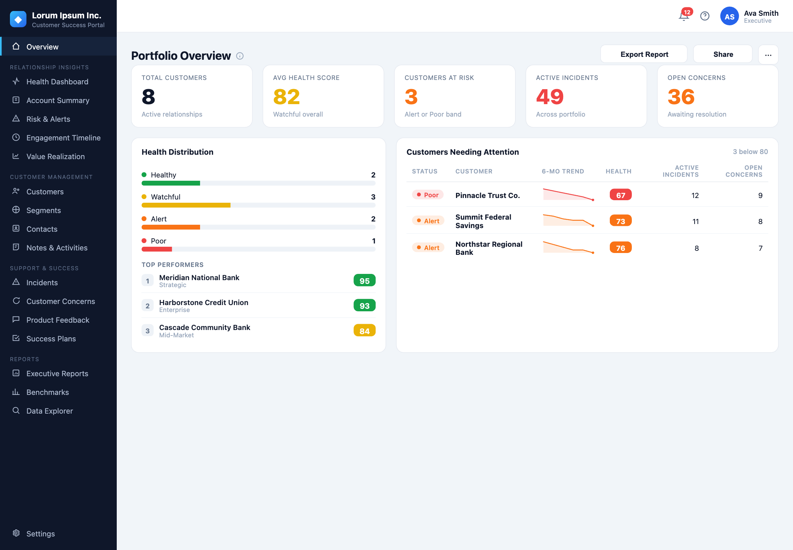
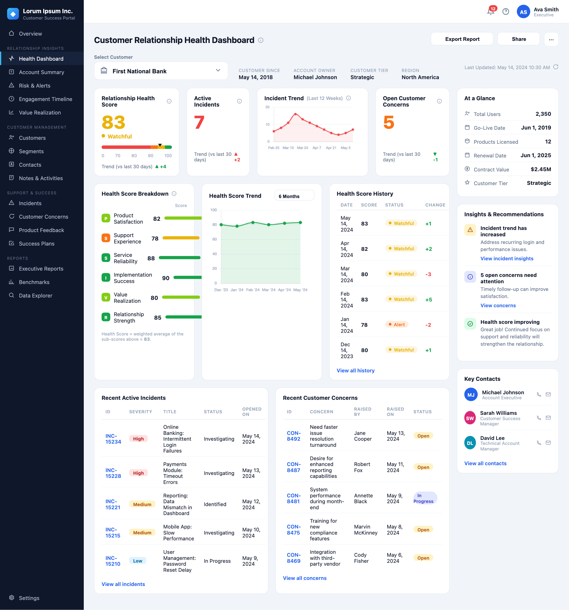
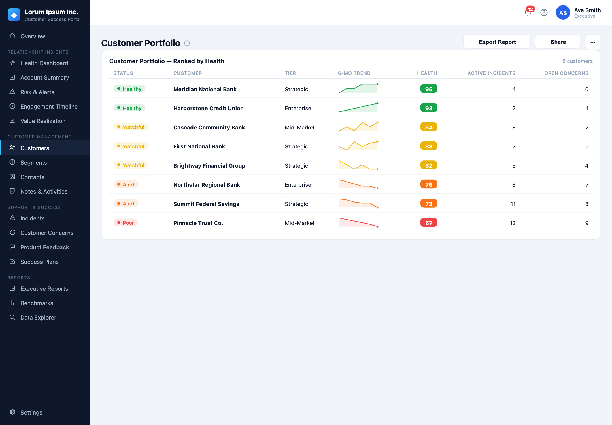

# Customer Relationship Health Dashboard

An executive-facing **Customer Relationship Health** portal for a fictional banking-software vendor, *Lorum Ipsum Inc.*, which serves thousands of banks. A C-Suite user picks a customer and instantly sees a **health score (1–100)**, the drivers behind it, active incidents, open concerns, and trends — plus a portfolio-wide overview across all customers.

It is a **single self-contained HTML file** (`dashboard.html`) that reads its data from an external `data.json`. No build step, no framework, no backend.

**▶ Live demo: <https://anoopnair-aipm.github.io/customer-relationship-health/>**



---

## Health score bands

Each customer's score maps to one of four color-coded bands:

| Band | Score range | Color |
|------|-------------|-------|
| 🟢 **Healthy** | 90–100 | Green |
| 🟡 **Watchful** | 80–89 | Amber |
| 🟠 **Alert** | 70–79 | Orange |
| 🔴 **Poor** | below 70 | Red |

---

## Features

### Portfolio Overview (landing page)
- KPI strip: total customers, average health, customers at risk, active incidents, open concerns.
- Health distribution bars, top performers, and a **"Customers Needing Attention"** table with inline 6-month **sparklines**.

### Customer Health Dashboard
- Big **health score** with band chip and 30-day trend.
- **Active incidents** and **open concerns** counts, each with trend vs. the last 30 days.
- **Incident Trend** chart (last 12 weeks) and **Health Score Trend** area chart (6 / 12 months).
- **Health Score Breakdown** — the six weighted sub-scores that produce the overall number.
- **Health Score History** table, **Insights & Recommendations**, **At a Glance** facts, and **Key Contacts**.
- Recent incidents and recent customer concerns tables.



### Customer Portfolio
- All customers ranked by health, each with status, tier, a 6-month trend sparkline, and incident/concern counts.



### Cross-cutting
- **Score is computed**, not hard-coded — a weighted average of six sub-scores (see below), kept consistent across the score, history, and trend.
- **External data** — everything is driven by `data.json`, so content can change without touching the HTML.
- **Working navigation & deep links** — the left nav and "View all" links switch views; the URL hash (`#dashboard/<customerId>`, `#overview`, `#customers`, …) is shareable and restored on load.
- **Export** — download the current view as **PDF** or **CSV** (context-aware: single customer vs. whole portfolio).
- **Share** — copy a deep link to the current view, or download the view as a **PNG**.

---

## How the health score is computed

The overall score is the weighted average of six sub-scores, rounded to the nearest integer:

| Sub-score | Weight |
|-----------|-------:|
| Product Satisfaction | 20% |
| Support Experience | 20% |
| Service Reliability | 20% |
| Implementation Success | 10% |
| Value Realization | 15% |
| Relationship Strength | 15% |

Weights live in `data.json` under `scoreWeights` (they sum to 1.0). The most recent history row and the last point of the score trend are overridden to match the computed value so nothing on screen contradicts the headline number.

---

## Running locally

Because the dashboard loads `data.json` with `fetch()`, it must be served over HTTP — opening the file directly with `file://` will be blocked by the browser. From the project folder:

```bash
python3 -m http.server 8000
```

Then open <http://localhost:8000/dashboard.html>.

(Any static file server works — e.g. `npx serve`.)

---

## Project structure

```
.
├── dashboard.html          # The entire app (HTML + CSS + JS, self-contained)
├── data.json               # Mock data: score weights, labels, and 8 customers
├── docs/screenshots/       # Screenshots used in this README
└── .claude/launch.json     # Local dev-server config (python http.server on port 8992)
```

### `data.json` shape

- `scoreWeights` — the six sub-score weights (sum = 1.0).
- `weekLabels` (12) / `monthLabels` (6) — axis labels for the trend charts.
- `customers[]` — each with: `id`, `name`, `since`, `owner`, `tier`, `region`, `updated`, `incidents`, `concerns`, trend deltas, `incidentSeries` (12), `scoreSeries` (6), `breakdown` (6 sub-scores), `glance`, `history`, `incidentList`, `concernList`, and `contacts`.

The eight sample banks span all four health bands, from *Meridian National Bank* (Healthy) down to *Pinnacle Trust Co.* (Poor).

---

## Tech

- Vanilla HTML / CSS / JavaScript — no framework, no build.
- [Chart.js](https://www.chartjs.org/) — incident and score trend charts.
- [jsPDF](https://github.com/parallax/jsPDF) + AutoTable — PDF export.
- [html2canvas](https://html2canvas.hertzen.com/) — PNG export.

All libraries are loaded from a CDN, so an internet connection is needed the first time the page loads.

> **Note:** All data is fictional and for demonstration only.
